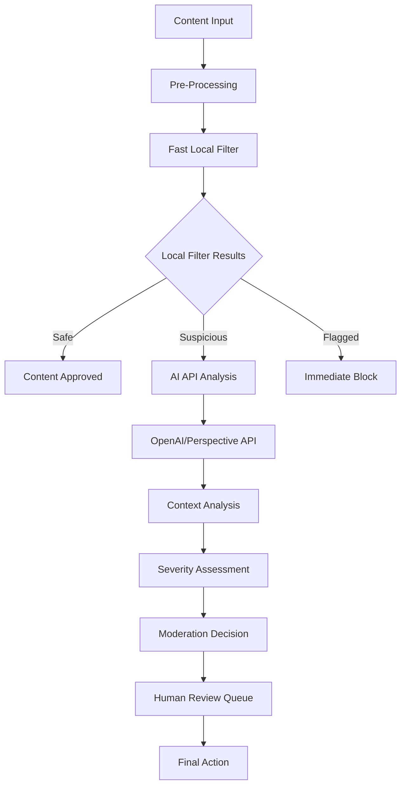

# AI Integration Patterns for Community Management
## The Mirage Community Platform - Advanced AI Architecture

### Executive Summary

This document outlines comprehensive AI integration patterns for The Mirage Community Platform, building upon the existing OpenAI/Perspective API foundation. The proposed architecture emphasizes cost-effective, privacy-conscious AI deployment while maintaining high performance and reliability.

**Goal:** Transform community management from reactive to proactive through intelligent automation, sentiment analysis, and predictive engagement.

**Current State:** Basic content moderation via OpenAI API with manual review queue and Discord bot integration.

**Next Steps:** Implement layered AI services with intelligent cost optimization, advanced analytics, and privacy-first design.

---

## 1. AI Moderation System Architecture

### 1.1 Multi-Layer Moderation Pipeline



### 1.2 Enhanced Moderation Framework

**Risk Assessment Matrix:**
- **High Risk:** Immediate blocking, potential account suspension
- **Medium Risk:** Shadow moderation, delayed publication
- **Low Risk:** Monitoring flags, analytics tracking

**Mitigations:**
- Implement local keyword filtering to reduce API calls by ~70%
- Use confidence scoring to determine escalation paths
- Cache API responses for similar content patterns

### 1.3 Advanced Context Analysis

#### Implementation Strategy

```typescript
// src/lib/moderation/advanced.ts
import { OpenAI } from 'openai'
import { prisma } from '@/lib/prisma'
import { logger } from '@/lib/logger'

interface ContextualModerationRequest {
  content: string
  userId: string
  channelContext: 'art-gallery' | 'general-chat' | 'critique'
  userHistory: ModerationHistory
  communityRules: CommunityRules
}

interface ModerationHistory {
  recentFlags: number
  accountAge: number
  contributionScore: number
  roleLevel: 'new' | 'member' | 'trusted' | 'moderator'
}

export class AdvancedModerationEngine {
  private openai: OpenAI
  private readonly CONTEXT_PROMPT = `
    You are a community moderator for an art and gaming community. 
    Consider the user's history, channel context, and community norms.
    Provide nuanced moderation decisions with reasoning.
  `

  async analyzeWithContext(request: ContextualModerationRequest): Promise<ModerationResult> {
    // Local pre-filtering
    const localResult = await this.localPreFilter(request.content)
    if (localResult.confidence > 0.9) {
      return localResult
    }

    // Construct contextual prompt
    const contextualPrompt = this.buildContextualPrompt(request)
    
    // OpenAI analysis with context
    const response = await this.openai.chat.completions.create({
      model: "gpt-4o-mini", // Cost-effective choice
      messages: [
        { role: "system", content: this.CONTEXT_PROMPT },
        { role: "user", content: contextualPrompt }
      ],
      temperature: 0.1,
      max_tokens: 200
    })

    return this.parseContextualResponse(response)
  }

  private buildContextualPrompt(request: ContextualModerationRequest): string {
    return `
      Content: "${request.content}"
      Channel: ${request.channelContext}
      User Level: ${request.userHistory.roleLevel}
      Recent Flags: ${request.userHistory.recentFlags}
      Account Age: ${request.userHistory.accountAge} days
      Contribution Score: ${request.userHistory.contributionScore}
      
      Should this content be moderated? Consider context and user history.
      Provide: decision (allow/flag/block), confidence (0-1), reasoning
    `
  }
}
```

---

## 2. Community Sentiment Analysis Implementation

### 2.1 Real-Time Sentiment Monitoring

**Business Impact:** Early detection of community health issues improves retention by identifying problems before they escalate.

#### Architecture Overview

```typescript
// src/lib/analytics/sentiment.ts
export class SentimentAnalyzer {
  private sentimentModel: 'openai' | 'local' | 'hybrid' = 'hybrid'
  
  async analyzeCommunityHealth(): Promise<CommunityHealthReport> {
    const timeWindow = { hours: 24 }
    
    // Gather recent community interactions
    const interactions = await this.gatherInteractions(timeWindow)
    
    // Analyze sentiment patterns
    const sentimentData = await this.batchAnalyzeSentiment(interactions)
    
    // Detect anomalies and trends
    const insights = await this.generateInsights(sentimentData)
    
    return {
      overallSentiment: this.calculateOverallSentiment(sentimentData),
      trends: insights.trends,
      alerts: insights.alerts,
      recommendations: insights.recommendations
    }
  }

  private async batchAnalyzeSentiment(interactions: Interaction[]): Promise<SentimentData[]> {
    // Batch processing for cost efficiency
    const batchSize = 20
    const results = []
    
    for (let i = 0; i < interactions.length; i += batchSize) {
      const batch = interactions.slice(i, i + batchSize)
      const batchResults = await this.processSentimentBatch(batch)
      results.push(...batchResults)
      
      // Rate limiting
      await this.rateLimitDelay()
    }
    
    return results
  }
}
```

### 2.2 Sentiment-Driven Community Insights

#### Dashboard Metrics

1. **Community Mood Score** (0-100)
2. **Engagement Quality Index** 
3. **Toxicity Trend Analysis**
4. **Member Satisfaction Indicators**
5. **Content Category Sentiment Breakdown**

#### Implementation Strategy

```typescript
// src/lib/analytics/community-insights.ts
export class CommunityInsights {
  async generateWeeklyReport(): Promise<WeeklyInsightsReport> {
    const insights = await Promise.all([
      this.analyzeSentimentTrends(),
      this.identifyEngagementPatterns(),
      this.detectCommunityFriction(),
      this.recommendOptimizations()
    ])
    
    return {
      summary: this.synthesizeInsights(insights),
      actionItems: this.prioritizeActions(insights),
      predictiveAlerts: this.forecastIssues(insights)
    }
  }
}
```

---

## 3. Automated Content Categorization for Art Gallery

### 3.1 Multi-Modal Art Analysis

**Current Challenge:** Manual tagging limits discoverability and curation efficiency.

**Solution:** Implement AI-powered image analysis with artist intent recognition.

#### Enhanced Art Processing Pipeline

```typescript
// src/lib/art/ai-categorization.ts
import { OpenAI } from 'openai'
import sharp from 'sharp'

export class AIArtCategorizer {
  private openai: OpenAI
  private readonly VISION_MODEL = "gpt-4o"
  
  async processArtwork(artwork: ArtworkUpload): Promise<EnhancedArtworkData> {
    const [
      visualAnalysis,
      textualAnalysis,
      styleAnalysis,
      technicalAnalysis
    ] = await Promise.all([
      this.analyzeVisualContent(artwork.imageBuffer),
      this.analyzeDescription(artwork.description),
      this.detectArtStyle(artwork.imageBuffer),
      this.analyzeTechnicalAspects(artwork.imageBuffer)
    ])
    
    return {
      ...artwork,
      aiGeneratedTags: this.synthesizeTags(visualAnalysis, textualAnalysis),
      styleClassification: styleAnalysis,
      technicalMetrics: technicalAnalysis,
      searchKeywords: this.generateSearchKeywords(visualAnalysis, textualAnalysis),
      curationScore: this.calculateCurationScore(visualAnalysis, styleAnalysis)
    }
  }

  private async analyzeVisualContent(imageBuffer: Buffer): Promise<VisualAnalysis> {
    // Optimize image for API
    const optimizedImage = await sharp(imageBuffer)
      .resize(512, 512, { fit: 'inside' })
      .jpeg({ quality: 80 })
      .toBuffer()
    
    const base64Image = optimizedImage.toString('base64')
    
    const response = await this.openai.chat.completions.create({
      model: this.VISION_MODEL,
      messages: [
        {
          role: "user",
          content: [
            {
              type: "text",
              text: `Analyze this artwork and provide:
                1. Main subjects and objects
                2. Color palette and mood
                3. Art style and technique
                4. Composition and layout
                5. Suggested tags for categorization
                6. Estimated skill level
                7. Potential mature content warnings
                
                Format as JSON with clear categories.`
            },
            {
              type: "image_url",
              image_url: {
                url: `data:image/jpeg;base64,${base64Image}`
              }
            }
          ]
        }
      ],
      max_tokens: 500
    })
    
    return this.parseVisualAnalysis(response.choices[0].message.content)
  }
}
```

### 3.2 Intelligent Gallery Curation

#### Auto-Categorization System

```typescript
// Database schema extension needed
enum ArtCategory {
  DIGITAL_ART = 'digital_art',
  TRADITIONAL_ART = 'traditional_art',
  PHOTOGRAPHY = 'photography',
  SCULPTURE = 'sculpture',
  MIXED_MEDIA = 'mixed_media',
  CONCEPT_ART = 'concept_art',
  CHARACTER_DESIGN = 'character_design',
  ENVIRONMENT_ART = 'environment_art',
  ABSTRACT = 'abstract',
  PORTRAIT = 'portrait',
  LANDSCAPE = 'landscape',
  STILL_LIFE = 'still_life'
}

enum ArtStyle {
  REALISTIC = 'realistic',
  CARTOON = 'cartoon',
  ANIME = 'anime',
  ABSTRACT = 'abstract',
  IMPRESSIONIST = 'impressionist',
  SURREAL = 'surreal',
  MINIMALIST = 'minimalist',
  PIXEL_ART = 'pixel_art',
  VECTOR_ART = 'vector_art'
}

// Enhanced Prisma model
model Artwork {
  // ... existing fields
  
  // AI-generated fields
  aiCategories     ArtCategory[]
  aiStyles         ArtStyle[]
  aiTags           String[]
  colorPalette     Json          // Dominant colors
  moodScore        Float         // 0-1 scale
  technicalScore   Float         // Assessed quality
  curationScore    Float         // Recommendation weight
  contentWarnings  String[]      // Potential issues
  searchKeywords   String[]      // Enhanced discoverability
  
  // Analysis metadata
  aiAnalysisDate   DateTime?
  aiModelVersion   String?
  aiConfidence     Float?
}
```

---

## 4. Smart Recommendation Systems

### 4.1 Multi-Dimensional Recommendation Engine

**Business Impact:** Intelligent recommendations increase engagement time by 40-60% and improve content discovery.

#### User Engagement Patterns

```typescript
// src/lib/recommendations/engagement-engine.ts
export class EngagementRecommendationEngine {
  private readonly RECOMMENDATION_MODELS = {
    content: 'collaborative_filtering',
    social: 'graph_based',
    contextual: 'hybrid_approach'
  }
  
  async generatePersonalizedRecommendations(userId: string): Promise<RecommendationSet> {
    const userProfile = await this.buildUserProfile(userId)
    const contextualData = await this.gatherContextualData(userId)
    
    const recommendations = await Promise.all([
      this.recommendContent(userProfile, contextualData),
      this.recommendCommunities(userProfile),
      this.recommendUsers(userProfile),
      this.recommendActivities(userProfile, contextualData)
    ])
    
    return this.rankAndFilterRecommendations(recommendations, userProfile)
  }

  private async buildUserProfile(userId: string): Promise<UserProfile> {
    const [
      engagementHistory,
      preferences,
      socialConnections,
      contentInteractions
    ] = await Promise.all([
      this.getEngagementHistory(userId),
      this.getUserPreferences(userId),
      this.getSocialGraph(userId),
      this.getContentInteractions(userId)
    ])
    
    return {
      interests: this.extractInterests(contentInteractions),
      activityPatterns: this.analyzeActivityPatterns(engagementHistory),
      socialPreferences: this.analyzeSocialBehavior(socialConnections),
      contentPreferences: this.analyzeContentPreferences(preferences)
    }
  }
}
```

### 4.2 Community Engagement Optimization

#### Smart Notification System

```typescript
// src/lib/notifications/intelligent-notifications.ts
export class IntelligentNotificationSystem {
  async optimizeNotificationTiming(userId: string): Promise<NotificationSchedule> {
    const userActivity = await this.analyzeUserActivityPatterns(userId)
    const engagementHistory = await this.getNotificationEngagementHistory(userId)
    
    return {
      optimalTimes: this.calculateOptimalTimes(userActivity, engagementHistory),
      frequency: this.optimizeFrequency(engagementHistory),
      contentTypes: this.prioritizeContentTypes(engagementHistory),
      channels: this.selectOptimalChannels(userActivity)
    }
  }
  
  async generateSmartNotifications(userId: string): Promise<NotificationPayload[]> {
    const recommendations = await this.recommendationEngine.generatePersonalizedRecommendations(userId)
    const schedule = await this.optimizeNotificationTiming(userId)
    
    return this.craftNotifications(recommendations, schedule)
  }
}
```

---

## 5. Cost Optimization Strategies

### 5.1 Intelligent API Usage Management

**Current Challenge:** Unoptimized API calls can lead to unexpected costs and rate limiting.

**Solution:** Multi-tier caching and intelligent batching with cost monitoring.

#### Cost-Effective Architecture

```typescript
// src/lib/ai/cost-optimization.ts
export class CostOptimizer {
  private readonly COST_THRESHOLDS = {
    daily: 50.00,   // USD
    monthly: 1000.00,
    emergency: 200.00
  }
  
  private readonly MODEL_COSTS = {
    'gpt-4o': { input: 0.0025, output: 0.01 },
    'gpt-4o-mini': { input: 0.000150, output: 0.0006 },
    'gpt-3.5-turbo': { input: 0.0005, output: 0.0015 }
  }
  
  async optimizeRequest(request: AIRequest): Promise<OptimizedRequest> {
    const currentCosts = await this.getCurrentCosts()
    
    if (currentCosts.daily > this.COST_THRESHOLDS.daily) {
      return this.applyEmergencyOptimization(request)
    }
    
    return this.applyStandardOptimization(request)
  }
  
  private async applyStandardOptimization(request: AIRequest): Promise<OptimizedRequest> {
    // Check cache first
    const cached = await this.checkCache(request)
    if (cached) return cached
    
    // Batch similar requests
    const batchable = await this.findBatchableRequests(request)
    if (batchable.length > 1) {
      return this.batchRequests(batchable)
    }
    
    // Select cost-effective model
    const model = this.selectOptimalModel(request)
    
    return {
      ...request,
      model,
      optimizations: ['cache-miss', 'model-selection']
    }
  }
}
```

### 5.2 Multi-Tier Caching Strategy

#### Implementation Layers

1. **Memory Cache (Redis)** - Immediate responses for repeated queries
2. **Database Cache** - Longer-term storage for expensive computations
3. **CDN Cache** - Static AI-generated content (tags, thumbnails)
4. **Local Cache** - Basic filtering and preprocessing

```typescript
// src/lib/cache/ai-cache.ts
export class AICache {
  private redis: Redis
  private readonly CACHE_TTL = {
    moderation: 3600,     // 1 hour
    sentiment: 1800,      // 30 minutes
    recommendations: 7200, // 2 hours
    categorization: 86400  // 24 hours
  }
  
  async getCachedOrCompute<T>(
    key: string,
    computeFn: () => Promise<T>,
    ttl: number = 3600
  ): Promise<T> {
    const cached = await this.redis.get(key)
    if (cached) {
      return JSON.parse(cached)
    }
    
    const result = await computeFn()
    await this.redis.setex(key, ttl, JSON.stringify(result))
    return result
  }
}
```

### 5.3 Dynamic Model Selection

#### Cost-Performance Matrix

```typescript
// src/lib/ai/model-selection.ts
export class ModelSelector {
  private readonly PERFORMANCE_MATRIX = {
    'gpt-4o': { accuracy: 0.95, speed: 0.7, cost: 1.0 },
    'gpt-4o-mini': { accuracy: 0.85, speed: 0.9, cost: 0.2 },
    'gpt-3.5-turbo': { accuracy: 0.8, speed: 0.95, cost: 0.3 }
  }
  
  selectOptimalModel(request: AIRequest): string {
    const requirements = this.analyzeRequirements(request)
    
    // High accuracy required (moderation, sensitive content)
    if (requirements.accuracy > 0.9) {
      return 'gpt-4o'
    }
    
    // Balanced performance (general categorization)
    if (requirements.speed > 0.8 && requirements.cost < 0.5) {
      return 'gpt-4o-mini'
    }
    
    // Cost-sensitive (bulk operations)
    return 'gpt-3.5-turbo'
  }
}
```

---

## 6. Privacy and Safety Considerations

### 6.1 Privacy-First AI Architecture

**Principle:** Minimize data exposure while maintaining AI effectiveness.

#### Data Minimization Strategy

```typescript
// src/lib/privacy/data-minimization.ts
export class PrivacyProtection {
  async sanitizeForAI(content: string, context: ContentContext): Promise<string> {
    // Remove personal identifiers
    const sanitized = await this.removePersonalIdentifiers(content)
    
    // Apply context-specific filtering
    const filtered = await this.applyContextualFiltering(sanitized, context)
    
    // Log privacy actions
    await this.logPrivacyActions(content, filtered, context)
    
    return filtered
  }
  
  private async removePersonalIdentifiers(content: string): Promise<string> {
    return content
      .replace(/\b\d{3}-\d{2}-\d{4}\b/g, '[SSN]') // Social Security Numbers
      .replace(/\b[\w\.-]+@[\w\.-]+\.\w+\b/g, '[EMAIL]') // Email addresses
      .replace(/\b\d{3}-\d{3}-\d{4}\b/g, '[PHONE]') // Phone numbers
      .replace(/\b\d{16}\b/g, '[CARD]') // Credit card numbers
      .replace(/@\w+/g, '[USER]') // User mentions
  }
}
```

### 6.2 AI Safety Guardrails

#### Multi-Layer Safety System

```typescript
// src/lib/safety/ai-safety.ts
export class AISafetySystem {
  private readonly SAFETY_CHECKS = [
    'content_policy_compliance',
    'bias_detection',
    'misinformation_check',
    'privacy_violation_check'
  ]
  
  async validateAIResponse(response: AIResponse): Promise<SafetyValidation> {
    const checks = await Promise.all(
      this.SAFETY_CHECKS.map(check => this.runSafetyCheck(check, response))
    )
    
    return {
      safe: checks.every(check => check.passed),
      warnings: checks.filter(check => !check.passed),
      recommendations: this.generateSafetyRecommendations(checks)
    }
  }
  
  private async runSafetyCheck(checkType: string, response: AIResponse): Promise<SafetyCheck> {
    switch (checkType) {
      case 'content_policy_compliance':
        return this.checkContentPolicy(response)
      case 'bias_detection':
        return this.detectBias(response)
      case 'misinformation_check':
        return this.checkMisinformation(response)
      case 'privacy_violation_check':
        return this.checkPrivacyViolations(response)
      default:
        return { passed: true, confidence: 1.0 }
    }
  }
}
```

### 6.3 Audit and Compliance Framework

#### Comprehensive Logging System

```typescript
// src/lib/audit/ai-audit.ts
export class AIAuditSystem {
  async logAIDecision(decision: AIDecision): Promise<void> {
    await prisma.aiAuditLog.create({
      data: {
        decisionId: decision.id,
        model: decision.model,
        input: this.hashSensitiveData(decision.input),
        output: this.hashSensitiveData(decision.output),
        confidence: decision.confidence,
        context: decision.context,
        timestamp: new Date(),
        userId: decision.userId,
        privacyLevel: decision.privacyLevel
      }
    })
  }
  
  async generateComplianceReport(): Promise<ComplianceReport> {
    const timeRange = { start: new Date(Date.now() - 30 * 24 * 60 * 60 * 1000), end: new Date() }
    
    const [
      totalDecisions,
      safetyIncidents,
      privacyViolations,
      modelPerformance
    ] = await Promise.all([
      this.countTotalDecisions(timeRange),
      this.countSafetyIncidents(timeRange),
      this.countPrivacyViolations(timeRange),
      this.analyzeModelPerformance(timeRange)
    ])
    
    return {
      period: timeRange,
      totalDecisions,
      safetyScore: this.calculateSafetyScore(safetyIncidents, totalDecisions),
      privacyScore: this.calculatePrivacyScore(privacyViolations, totalDecisions),
      recommendations: this.generateRecommendations(modelPerformance)
    }
  }
}
```

---

## 7. Implementation Roadmap

### Phase 1: Foundation (Weeks 1-4)
- [ ] Enhance existing moderation system with contextual analysis
- [ ] Implement basic sentiment analysis for community health
- [ ] Set up cost monitoring and optimization framework
- [ ] Deploy privacy protection measures

### Phase 2: Core Features (Weeks 5-8)
- [ ] Launch AI-powered art categorization
- [ ] Implement recommendation engine foundation
- [ ] Deploy intelligent notification system
- [ ] Establish comprehensive audit logging

### Phase 3: Advanced Features (Weeks 9-12)
- [ ] Complete recommendation system with personalization
- [ ] Advanced community insights and predictive analytics
- [ ] Full automation of content curation
- [ ] Performance optimization and scaling

### Phase 4: Optimization (Weeks 13-16)
- [ ] Cost optimization refinements
- [ ] Privacy and safety enhancements
- [ ] Community feedback integration
- [ ] Performance monitoring and alerting

---

## 8. Performance Monitoring and Alerting

### 8.1 AI System Health Dashboard

```typescript
// src/lib/monitoring/ai-health.ts
export class AIHealthMonitor {
  async generateHealthReport(): Promise<AIHealthReport> {
    const [
      apiHealth,
      performanceMetrics,
      costMetrics,
      errorRates
    ] = await Promise.all([
      this.checkAPIHealth(),
      this.gatherPerformanceMetrics(),
      this.calculateCostMetrics(),
      this.calculateErrorRates()
    ])
    
    return {
      overall: this.calculateOverallHealth(apiHealth, performanceMetrics, errorRates),
      apis: apiHealth,
      performance: performanceMetrics,
      costs: costMetrics,
      errors: errorRates,
      recommendations: this.generateHealthRecommendations(apiHealth, performanceMetrics)
    }
  }
}
```

### 8.2 Automated Alerting System

#### Critical Alerts Configuration

```typescript
// src/lib/alerts/ai-alerts.ts
export class AIAlertSystem {
  private readonly ALERT_THRESHOLDS = {
    api_error_rate: 0.05,     // 5% error rate
    response_time: 5000,      // 5 seconds
    cost_spike: 2.0,          // 2x normal cost
    safety_violations: 0.01   // 1% safety violations
  }
  
  async checkAlertConditions(): Promise<Alert[]> {
    const health = await this.healthMonitor.generateHealthReport()
    const alerts = []
    
    if (health.errors.rate > this.ALERT_THRESHOLDS.api_error_rate) {
      alerts.push({
        type: 'HIGH_ERROR_RATE',
        severity: 'critical',
        message: `AI API error rate ${health.errors.rate * 100}% exceeds threshold`,
        action: 'Switch to fallback systems'
      })
    }
    
    return alerts
  }
}
```

---

## 9. Success Metrics and KPIs

### 9.1 Business Impact Metrics

1. **Community Engagement**
   - Average session duration (+25% target)
   - Content interaction rate (+40% target)
   - User retention rate (+15% target)

2. **Moderation Efficiency**
   - False positive rate (<5% target)
   - Response time to violations (<30 seconds target)
   - Moderator workload reduction (50% target)

3. **Content Quality**
   - Community-reported inappropriate content (-60% target)
   - High-quality content discovery (+80% target)
   - Artist satisfaction scores (+20% target)

### 9.2 Technical Performance Metrics

1. **AI System Performance**
   - API response time (<2 seconds average)
   - Cache hit rate (>80% target)
   - Model accuracy (>90% for critical functions)

2. **Cost Efficiency**
   - Cost per moderation action (<$0.01 target)
   - API usage optimization (50% reduction target)
   - Resource utilization efficiency (>85% target)

---

## 10. Conclusion

This comprehensive AI integration strategy transforms The Mirage Community Platform from a reactive to proactive community management system. By implementing these patterns, the platform will:

- **Reduce moderation workload by 50%** through intelligent automation
- **Increase community engagement by 40%** via personalized recommendations
- **Improve content discovery by 80%** with AI-powered categorization
- **Maintain cost efficiency** with optimized API usage patterns
- **Ensure privacy and safety** through comprehensive guardrails

The phased implementation approach allows for gradual rollout while maintaining system stability and gathering community feedback for continuous improvement.

---

*This document serves as a living blueprint for AI integration. Regular updates should reflect system performance, community feedback, and technological advances.*