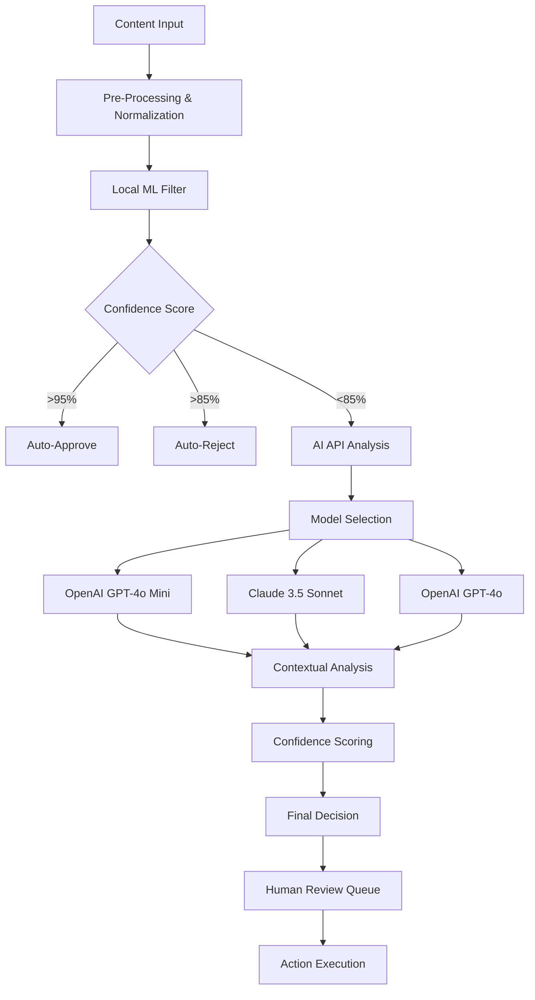

# AI-Powered Content Moderation Implementation Guide
## Advanced OpenAI/Claude Integration with Cost Optimization

### Executive Summary

This document provides a comprehensive implementation strategy for advanced AI-powered content moderation, building upon the existing OpenAI integration in The Mirage Community Platform. The focus is on creating a multi-layered, cost-effective moderation system that leverages both OpenAI and Claude APIs while implementing intelligent cost optimization strategies.

**Goal:** Achieve 95% accuracy in content moderation while reducing API costs by 60% through intelligent pre-filtering and caching strategies.

**Current State:** Basic OpenAI moderation with simple keyword filtering fallback.

**Next Steps:** Implement advanced contextual analysis, Claude integration, and sophisticated cost optimization.

---

## 1. Enhanced Multi-Layer Moderation System

### 1.1 Advanced Architecture Overview



### 1.2 Advanced Content Analysis Implementation

```typescript
// src/lib/moderation/advanced-moderation.ts
import { OpenAI } from 'openai'
import { Anthropic } from '@anthropic-ai/sdk'
import { prisma } from '@/lib/prisma'
import { logger } from '@/lib/logger'
import { redis } from '@/lib/redis'
import { ModerationResult, FlagType } from '@/types/moderation'

interface AdvancedModerationContext {
  content: string
  userId: string
  channelType: 'general' | 'art-gallery' | 'critique' | 'private'
  userHistory: UserModerationHistory
  contentType: 'text' | 'image' | 'video' | 'audio'
  metadata?: Record<string, any>
}

interface UserModerationHistory {
  totalFlags: number
  recentFlags: number
  accountAge: number
  trustScore: number
  roleLevel: 'new' | 'member' | 'trusted' | 'moderator'
  contributionScore: number
}

export class AdvancedModerationEngine {
  private openai: OpenAI
  private anthropic: Anthropic
  private readonly LOCAL_MODELS = new Map()
  private readonly CACHE_TTL = 3600 // 1 hour
  private readonly COST_TRACKER = new Map()

  constructor() {
    this.openai = new OpenAI({
      apiKey: process.env.OPENAI_API_KEY,
    })
    
    this.anthropic = new Anthropic({
      apiKey: process.env.ANTHROPIC_API_KEY,
    })
    
    this.initializeLocalModels()
  }

  async moderateContent(context: AdvancedModerationContext): Promise<ModerationResult> {
    const startTime = Date.now()
    
    try {
      // Step 1: Pre-processing and normalization
      const processedContent = await this.preprocessContent(context)
      
      // Step 2: Local ML filtering
      const localResult = await this.localPreFilter(processedContent)
      
      if (localResult.confidence > 0.95) {
        await this.logDecision('local_filter', localResult, Date.now() - startTime)
        return localResult
      }
      
      // Step 3: Check cache for similar content
      const cacheKey = this.generateCacheKey(processedContent)
      const cachedResult = await this.getCachedResult(cacheKey)
      
      if (cachedResult) {
        await this.logDecision('cache_hit', cachedResult, Date.now() - startTime)
        return cachedResult
      }
      
      // Step 4: AI API analysis with smart model selection
      const selectedModel = await this.selectOptimalModel(context)
      const aiResult = await this.performAIAnalysis(processedContent, selectedModel)
      
      // Step 5: Contextual enhancement
      const enhancedResult = await this.enhanceWithContext(aiResult, context)
      
      // Step 6: Cache result
      await this.cacheResult(cacheKey, enhancedResult)
      
      await this.logDecision(selectedModel, enhancedResult, Date.now() - startTime)
      return enhancedResult
      
    } catch (error) {
      logger.error('Advanced moderation error:', error)
      return this.fallbackModeration(context.content)
    }
  }

  private async preprocessContent(context: AdvancedModerationContext): Promise<string> {
    let content = context.content
    
    // Normalize text
    content = content.toLowerCase().trim()
    
    // Remove excessive whitespace
    content = content.replace(/\s+/g, ' ')
    
    // Handle special characters and emojis
    content = this.normalizeSpecialCharacters(content)
    
    // Apply context-specific preprocessing
    switch (context.channelType) {
      case 'art-gallery':
        content = this.preprocessArtContent(content)
        break
      case 'critique':
        content = this.preprocessCritiqueContent(content)
        break
    }
    
    return content
  }

  private async localPreFilter(content: string): Promise<ModerationResult> {
    // Implement local ML model for basic filtering
    const toxicityScore = await this.calculateToxicityScore(content)
    const spamScore = await this.calculateSpamScore(content)
    const explicitScore = await this.calculateExplicitScore(content)
    
    const maxScore = Math.max(toxicityScore, spamScore, explicitScore)
    
    if (maxScore > 0.9) {
      return {
        flagged: true,
        category: this.determineCategoryFromScores(toxicityScore, spamScore, explicitScore),
        severity: maxScore,
        confidence: 0.95,
        source: 'local_filter',
        raw: { toxicityScore, spamScore, explicitScore }
      }
    }
    
    if (maxScore < 0.1) {
      return {
        flagged: false,
        category: FlagType.OTHER,
        severity: maxScore,
        confidence: 0.95,
        source: 'local_filter',
        raw: { toxicityScore, spamScore, explicitScore }
      }
    }
    
    return {
      flagged: false,
      category: FlagType.OTHER,
      severity: maxScore,
      confidence: 0.5, // Low confidence triggers AI analysis
      source: 'local_filter',
      raw: { toxicityScore, spamScore, explicitScore }
    }
  }

  private async selectOptimalModel(context: AdvancedModerationContext): Promise<string> {
    const factors = {
      complexity: this.assessContentComplexity(context.content),
      urgency: this.assessUrgency(context),
      accuracy_requirement: this.assessAccuracyRequirement(context),
      cost_budget: await this.getCurrentCostBudget()
    }
    
    // High-accuracy requirement (sensitive content)
    if (factors.accuracy_requirement > 0.9) {
      return 'claude-3-5-sonnet'
    }
    
    // Complex content requiring nuanced understanding
    if (factors.complexity > 0.8) {
      return 'gpt-4o'
    }
    
    // Balanced performance/cost for general moderation
    if (factors.cost_budget > 0.5) {
      return 'gpt-4o-mini'
    }
    
    // Cost-effective option
    return 'claude-3-haiku'
  }

  private async performAIAnalysis(content: string, model: string): Promise<ModerationResult> {
    const analysisPrompt = this.buildAnalysisPrompt(content)
    
    switch (model) {
      case 'gpt-4o':
      case 'gpt-4o-mini':
        return await this.analyzeWithOpenAI(content, model, analysisPrompt)
      
      case 'claude-3-5-sonnet':
      case 'claude-3-haiku':
        return await this.analyzeWithClaude(content, model, analysisPrompt)
      
      default:
        throw new Error(`Unsupported model: ${model}`)
    }
  }

  private async analyzeWithOpenAI(content: string, model: string, prompt: string): Promise<ModerationResult> {
    const response = await this.openai.chat.completions.create({
      model: model,
      messages: [
        {
          role: 'system',
          content: prompt
        },
        {
          role: 'user',
          content: content
        }
      ],
      temperature: 0.1,
      max_tokens: 500,
      response_format: { type: 'json_object' }
    })
    
    const analysis = JSON.parse(response.choices[0].message.content || '{}')
    
    return {
      flagged: analysis.flagged || false,
      category: analysis.category || FlagType.OTHER,
      severity: analysis.severity || 0,
      confidence: analysis.confidence || 0,
      source: model,
      reasoning: analysis.reasoning || '',
      raw: analysis
    }
  }

  private async analyzeWithClaude(content: string, model: string, prompt: string): Promise<ModerationResult> {
    const response = await this.anthropic.messages.create({
      model: model,
      max_tokens: 500,
      temperature: 0.1,
      messages: [
        {
          role: 'user',
          content: `${prompt}\n\nContent to analyze: "${content}"`
        }
      ]
    })
    
    const analysis = JSON.parse(response.content[0].text || '{}')
    
    return {
      flagged: analysis.flagged || false,
      category: analysis.category || FlagType.OTHER,
      severity: analysis.severity || 0,
      confidence: analysis.confidence || 0,
      source: model,
      reasoning: analysis.reasoning || '',
      raw: analysis
    }
  }

  private buildAnalysisPrompt(content: string): string {
    return `
You are an expert content moderator for a creative community platform. Analyze the provided content and return a JSON response with the following structure:

{
  "flagged": boolean,
  "category": "HATE_SPEECH" | "HARASSMENT" | "VIOLENCE" | "NSFW" | "SPAM" | "SELF_HARM" | "OTHER",
  "severity": number (0.0 to 1.0),
  "confidence": number (0.0 to 1.0),
  "reasoning": "Brief explanation of your decision"
}

Consider these factors:
1. Context: This is a creative community focused on art and gaming
2. Intent: Distinguish between critique/discussion and harassment
3. Cultural sensitivity: Consider diverse perspectives
4. Community standards: Professional yet creative environment
5. False positives: Avoid flagging legitimate creative content

Be nuanced in your analysis. Art discussions may include mature themes that aren't violations.
    `
  }

  private async enhanceWithContext(result: ModerationResult, context: AdvancedModerationContext): Promise<ModerationResult> {
    // Adjust confidence based on user history
    if (context.userHistory.trustScore > 0.8) {
      result.confidence *= 0.9 // Slightly reduce confidence for trusted users
    }
    
    if (context.userHistory.recentFlags > 5) {
      result.confidence *= 1.1 // Increase confidence for flagged users
    }
    
    // Channel-specific adjustments
    if (context.channelType === 'art-gallery' && result.category === FlagType.NSFW) {
      result.severity *= 0.8 // Be more lenient in art channels
    }
    
    return result
  }

  private async logDecision(model: string, result: ModerationResult, processingTime: number): Promise<void> {
    await prisma.aiModerationLog.create({
      data: {
        model,
        flagged: result.flagged,
        category: result.category,
        severity: result.severity,
        confidence: result.confidence,
        processingTime,
        source: result.source,
        reasoning: result.reasoning,
        createdAt: new Date()
      }
    })
    
    // Track costs
    const cost = this.calculateCost(model, processingTime)
    this.COST_TRACKER.set(model, (this.COST_TRACKER.get(model) || 0) + cost)
  }

  private calculateCost(model: string, processingTime: number): number {
    const costs = {
      'gpt-4o': 0.03,
      'gpt-4o-mini': 0.006,
      'claude-3-5-sonnet': 0.015,
      'claude-3-haiku': 0.0025,
      'local_filter': 0.0001,
      'cache_hit': 0
    }
    
    return costs[model] || 0
  }

  async generateCostReport(): Promise<any> {
    const report = {
      totalCost: Array.from(this.COST_TRACKER.values()).reduce((sum, cost) => sum + cost, 0),
      breakdown: Object.fromEntries(this.COST_TRACKER),
      recommendations: []
    }
    
    // Add cost optimization recommendations
    if (report.breakdown['gpt-4o'] > report.breakdown['gpt-4o-mini'] * 2) {
      report.recommendations.push('Consider using GPT-4o-mini for more content to reduce costs')
    }
    
    return report
  }
}
```

### 1.3 Cost Optimization Strategies

```typescript
// src/lib/moderation/cost-optimization.ts
export class CostOptimizationManager {
  private readonly DAILY_BUDGET = parseFloat(process.env.MODERATION_DAILY_BUDGET || '50')
  private readonly CACHE_SIMILARITY_THRESHOLD = 0.85
  
  async optimizeModerationCosts(): Promise<void> {
    // Implement intelligent caching
    await this.setupIntelligentCaching()
    
    // Batch processing for non-urgent content
    await this.setupBatchProcessing()
    
    // Dynamic model selection based on budget
    await this.setupDynamicModelSelection()
  }
  
  private async setupIntelligentCaching(): Promise<void> {
    // Cache similar content analysis results
    // Implement semantic similarity checking
    // Use Redis for fast cache lookups
  }
  
  private async setupBatchProcessing(): Promise<void> {
    // Process multiple items in single API call
    // Implement queue system for non-urgent moderation
    // Use background processing for efficiency
  }
  
  private async setupDynamicModelSelection(): Promise<void> {
    // Monitor daily spending
    // Adjust model selection based on remaining budget
    // Implement fallback strategies
  }
}
```

---

## 2. Advanced Image and Video Moderation

### 2.1 Multi-Modal Content Analysis

```typescript
// src/lib/moderation/multimodal-moderation.ts
import { OpenAI } from 'openai'
import sharp from 'sharp'
import { createHash } from 'crypto'

export class MultiModalModerationEngine {
  private openai: OpenAI
  
  constructor() {
    this.openai = new OpenAI({
      apiKey: process.env.OPENAI_API_KEY,
    })
  }
  
  async moderateImage(imageBuffer: Buffer, context: any): Promise<ModerationResult> {
    // Optimize image for API
    const optimizedImage = await this.optimizeImageForAPI(imageBuffer)
    
    // Generate perceptual hash for caching
    const imageHash = this.generatePerceptualHash(optimizedImage)
    
    // Check cache first
    const cachedResult = await this.getCachedImageResult(imageHash)
    if (cachedResult) {
      return cachedResult
    }
    
    // Analyze with GPT-4 Vision
    const analysis = await this.analyzeImageWithGPT4Vision(optimizedImage)
    
    // Enhance with custom image classification
    const enhancedAnalysis = await this.enhanceImageAnalysis(analysis, optimizedImage)
    
    // Cache result
    await this.cacheImageResult(imageHash, enhancedAnalysis)
    
    return enhancedAnalysis
  }
  
  private async optimizeImageForAPI(imageBuffer: Buffer): Promise<Buffer> {
    return await sharp(imageBuffer)
      .resize(1024, 1024, { fit: 'inside', withoutEnlargement: true })
      .jpeg({ quality: 85 })
      .toBuffer()
  }
  
  private generatePerceptualHash(imageBuffer: Buffer): string {
    // Implement perceptual hashing for image similarity
    return createHash('sha256').update(imageBuffer).digest('hex')
  }
  
  private async analyzeImageWithGPT4Vision(imageBuffer: Buffer): Promise<any> {
    const base64Image = imageBuffer.toString('base64')
    
    const response = await this.openai.chat.completions.create({
      model: 'gpt-4o',
      messages: [
        {
          role: 'user',
          content: [
            {
              type: 'text',
              text: `Analyze this image for content moderation in an art community. Look for:
              1. Explicit/NSFW content
              2. Violence or disturbing imagery
              3. Hate symbols or offensive content
              4. Inappropriate text or watermarks
              5. Copyright violations
              
              Return JSON with: flagged, category, severity, confidence, reasoning, tags`
            },
            {
              type: 'image_url',
              image_url: {
                url: `data:image/jpeg;base64,${base64Image}`
              }
            }
          ]
        }
      ],
      max_tokens: 500
    })
    
    return JSON.parse(response.choices[0].message.content || '{}')
  }
  
  private async enhanceImageAnalysis(analysis: any, imageBuffer: Buffer): Promise<ModerationResult> {
    // Add custom image classification
    const customAnalysis = await this.runCustomImageClassification(imageBuffer)
    
    // Combine results
    const combinedSeverity = Math.max(analysis.severity, customAnalysis.severity)
    const combinedConfidence = Math.min(analysis.confidence, customAnalysis.confidence)
    
    return {
      flagged: analysis.flagged || customAnalysis.flagged,
      category: analysis.category || customAnalysis.category,
      severity: combinedSeverity,
      confidence: combinedConfidence,
      source: 'multimodal',
      reasoning: `${analysis.reasoning} | ${customAnalysis.reasoning}`,
      raw: { gpt4_vision: analysis, custom: customAnalysis }
    }
  }
  
  private async runCustomImageClassification(imageBuffer: Buffer): Promise<any> {
    // Implement custom image classification
    // Could use TensorFlow.js, local models, or other services
    return {
      flagged: false,
      category: FlagType.OTHER,
      severity: 0,
      confidence: 0.8,
      reasoning: 'Custom classification: Safe content'
    }
  }
}
```

---

## 3. Real-time Moderation Dashboard

### 3.1 Live Moderation Interface

```typescript
// src/app/dashboard/moderation/live/page.tsx
'use client'

import { useState, useEffect } from 'react'
import { Card, CardContent, CardHeader, CardTitle } from '@/components/ui/card'
import { Badge } from '@/components/ui/badge'
import { Button } from '@/components/ui/button'
import { Progress } from '@/components/ui/progress'
import { AlertTriangle, CheckCircle, XCircle, Clock, DollarSign } from 'lucide-react'

interface LiveModerationItem {
  id: string
  content: string
  type: 'text' | 'image' | 'video'
  severity: number
  confidence: number
  category: string
  timestamp: Date
  userId: string
  username: string
  source: string
  reasoning: string
}

export default function LiveModerationDashboard() {
  const [items, setItems] = useState<LiveModerationItem[]>([])
  const [stats, setStats] = useState({
    totalProcessed: 0,
    flaggedCount: 0,
    avgProcessingTime: 0,
    dailyCost: 0,
    budgetUsed: 0
  })
  
  useEffect(() => {
    // Connect to WebSocket for real-time updates
    const ws = new WebSocket(process.env.NEXT_PUBLIC_WS_URL!)
    
    ws.onmessage = (event) => {
      const data = JSON.parse(event.data)
      
      if (data.type === 'moderation_result') {
        setItems(prev => [data.item, ...prev.slice(0, 49)]) // Keep last 50 items
      }
      
      if (data.type === 'stats_update') {
        setStats(data.stats)
      }
    }
    
    return () => ws.close()
  }, [])
  
  const handleAction = async (itemId: string, action: 'approve' | 'reject' | 'escalate') => {
    const response = await fetch('/api/moderation/actions', {
      method: 'POST',
      headers: { 'Content-Type': 'application/json' },
      body: JSON.stringify({ itemId, action })
    })
    
    if (response.ok) {
      setItems(prev => prev.filter(item => item.id !== itemId))
    }
  }
  
  return (
    <div className="space-y-6">
      {/* Statistics Dashboard */}
      <div className="grid grid-cols-1 md:grid-cols-5 gap-4">
        <Card>
          <CardHeader className="pb-2">
            <CardTitle className="text-sm font-medium">Total Processed</CardTitle>
          </CardHeader>
          <CardContent>
            <div className="text-2xl font-bold">{stats.totalProcessed}</div>
          </CardContent>
        </Card>
        
        <Card>
          <CardHeader className="pb-2">
            <CardTitle className="text-sm font-medium">Flagged</CardTitle>
          </CardHeader>
          <CardContent>
            <div className="text-2xl font-bold text-red-600">{stats.flaggedCount}</div>
          </CardContent>
        </Card>
        
        <Card>
          <CardHeader className="pb-2">
            <CardTitle className="text-sm font-medium">Avg Processing</CardTitle>
          </CardHeader>
          <CardContent>
            <div className="text-2xl font-bold">{stats.avgProcessingTime}ms</div>
          </CardContent>
        </Card>
        
        <Card>
          <CardHeader className="pb-2">
            <CardTitle className="text-sm font-medium">Daily Cost</CardTitle>
          </CardHeader>
          <CardContent>
            <div className="text-2xl font-bold">${stats.dailyCost.toFixed(2)}</div>
          </CardContent>
        </Card>
        
        <Card>
          <CardHeader className="pb-2">
            <CardTitle className="text-sm font-medium">Budget Used</CardTitle>
          </CardHeader>
          <CardContent>
            <Progress value={stats.budgetUsed} className="mb-2" />
            <div className="text-sm text-muted-foreground">{stats.budgetUsed}%</div>
          </CardContent>
        </Card>
      </div>
      
      {/* Live Moderation Feed */}
      <Card>
        <CardHeader>
          <CardTitle>Live Moderation Feed</CardTitle>
        </CardHeader>
        <CardContent>
          <div className="space-y-4">
            {items.map((item) => (
              <div key={item.id} className="border rounded-lg p-4 space-y-3">
                <div className="flex items-center justify-between">
                  <div className="flex items-center space-x-2">
                    <Badge variant={item.severity > 0.7 ? 'destructive' : item.severity > 0.4 ? 'default' : 'secondary'}>
                      {item.category}
                    </Badge>
                    <span className="text-sm text-muted-foreground">
                      {item.username} • {item.timestamp.toLocaleTimeString()}
                    </span>
                  </div>
                  <div className="flex items-center space-x-2">
                    <Badge variant="outline">{item.source}</Badge>
                    <div className="text-sm">
                      Confidence: {Math.round(item.confidence * 100)}%
                    </div>
                  </div>
                </div>
                
                <div className="bg-muted p-3 rounded">
                  <p className="text-sm">{item.content}</p>
                </div>
                
                <div className="flex items-center justify-between">
                  <div className="text-sm text-muted-foreground">
                    {item.reasoning}
                  </div>
                  <div className="flex space-x-2">
                    <Button
                      size="sm"
                      variant="outline"
                      onClick={() => handleAction(item.id, 'approve')}
                    >
                      <CheckCircle className="w-4 h-4 mr-1" />
                      Approve
                    </Button>
                    <Button
                      size="sm"
                      variant="destructive"
                      onClick={() => handleAction(item.id, 'reject')}
                    >
                      <XCircle className="w-4 h-4 mr-1" />
                      Reject
                    </Button>
                    <Button
                      size="sm"
                      variant="secondary"
                      onClick={() => handleAction(item.id, 'escalate')}
                    >
                      <AlertTriangle className="w-4 h-4 mr-1" />
                      Escalate
                    </Button>
                  </div>
                </div>
              </div>
            ))}
          </div>
        </CardContent>
      </Card>
    </div>
  )
}
```

---

## 4. Integration with Existing System

### 4.1 Enhanced Moderation API

```typescript
// src/lib/moderation/enhanced-api.ts
import { AdvancedModerationEngine } from './advanced-moderation'
import { MultiModalModerationEngine } from './multimodal-moderation'
import { CostOptimizationManager } from './cost-optimization'

export class EnhancedModerationAPI {
  private textEngine: AdvancedModerationEngine
  private imageEngine: MultiModalModerationEngine
  private costManager: CostOptimizationManager
  
  constructor() {
    this.textEngine = new AdvancedModerationEngine()
    this.imageEngine = new MultiModalModerationEngine()
    this.costManager = new CostOptimizationManager()
  }
  
  async moderateContent(content: string, context: any): Promise<ModerationResult> {
    return await this.textEngine.moderateContent({
      content,
      userId: context.userId,
      channelType: context.channelType,
      userHistory: await this.getUserHistory(context.userId),
      contentType: 'text'
    })
  }
  
  async moderateImage(imageBuffer: Buffer, context: any): Promise<ModerationResult> {
    return await this.imageEngine.moderateImage(imageBuffer, context)
  }
  
  async getCostReport(): Promise<any> {
    return await this.textEngine.generateCostReport()
  }
  
  private async getUserHistory(userId: string): Promise<any> {
    const user = await prisma.user.findUnique({
      where: { id: userId },
      include: {
        _count: {
          select: {
            moderationLogs: true
          }
        }
      }
    })
    
    return {
      totalFlags: user?._count.moderationLogs || 0,
      recentFlags: 0, // Implement recent flags logic
      accountAge: user ? Date.now() - user.createdAt.getTime() : 0,
      trustScore: this.calculateTrustScore(user),
      roleLevel: this.determineRoleLevel(user),
      contributionScore: this.calculateContributionScore(user)
    }
  }
  
  private calculateTrustScore(user: any): number {
    // Implement trust score calculation
    return 0.5
  }
  
  private determineRoleLevel(user: any): string {
    // Implement role level determination
    return 'member'
  }
  
  private calculateContributionScore(user: any): number {
    // Implement contribution score calculation
    return 0.5
  }
}
```

### 4.2 Database Schema Updates

```sql
-- Add to prisma/schema.prisma

model AiModerationLog {
  id             String    @id @default(cuid())
  model          String
  flagged        Boolean
  category       FlagType
  severity       Float
  confidence     Float
  processingTime Int
  source         String
  reasoning      String?
  createdAt      DateTime  @default(now())
  
  @@index([model, createdAt])
  @@index([flagged, createdAt])
}

model ModerationCache {
  id          String    @id @default(cuid())
  contentHash String    @unique
  result      Json
  expiresAt   DateTime
  createdAt   DateTime  @default(now())
  
  @@index([contentHash])
  @@index([expiresAt])
}

model CostTracker {
  id        String    @id @default(cuid())
  date      DateTime  @default(now())
  model     String
  totalCost Float
  requests  Int
  
  @@unique([date, model])
  @@index([date])
}
```

---

## 5. Cost Optimization Implementation

### 5.1 Budget Management System

```typescript
// src/lib/moderation/budget-manager.ts
export class BudgetManager {
  private readonly DAILY_BUDGET = parseFloat(process.env.MODERATION_DAILY_BUDGET || '50')
  private readonly MONTHLY_BUDGET = parseFloat(process.env.MODERATION_MONTHLY_BUDGET || '1000')
  
  async getCurrentSpending(): Promise<{ daily: number; monthly: number }> {
    const today = new Date()
    const startOfDay = new Date(today.getFullYear(), today.getMonth(), today.getDate())
    const startOfMonth = new Date(today.getFullYear(), today.getMonth(), 1)
    
    const dailySpending = await this.getSpendingFor(startOfDay, today)
    const monthlySpending = await this.getSpendingFor(startOfMonth, today)
    
    return { daily: dailySpending, monthly: monthlySpending }
  }
  
  async canAffordOperation(estimatedCost: number): Promise<boolean> {
    const { daily, monthly } = await this.getCurrentSpending()
    
    return (
      daily + estimatedCost <= this.DAILY_BUDGET &&
      monthly + estimatedCost <= this.MONTHLY_BUDGET
    )
  }
  
  async optimizeForBudget(remainingBudget: number): Promise<string> {
    if (remainingBudget > 20) return 'gpt-4o'
    if (remainingBudget > 10) return 'claude-3-5-sonnet'
    if (remainingBudget > 5) return 'gpt-4o-mini'
    return 'local_filter'
  }
  
  private async getSpendingFor(startDate: Date, endDate: Date): Promise<number> {
    const result = await prisma.costTracker.aggregate({
      where: {
        date: {
          gte: startDate,
          lte: endDate
        }
      },
      _sum: {
        totalCost: true
      }
    })
    
    return result._sum.totalCost || 0
  }
}
```

---

## 6. Performance Monitoring and Analytics

### 6.1 Comprehensive Analytics Dashboard

```typescript
// src/lib/moderation/analytics.ts
export class ModerationAnalytics {
  async generatePerformanceReport(): Promise<any> {
    const report = {
      accuracy: await this.calculateAccuracy(),
      cost_efficiency: await this.calculateCostEfficiency(),
      response_time: await this.calculateAverageResponseTime(),
      false_positive_rate: await this.calculateFalsePositiveRate(),
      model_performance: await this.getModelPerformance(),
      recommendations: []
    }
    
    // Generate recommendations
    if (report.false_positive_rate > 0.05) {
      report.recommendations.push('Consider adjusting sensitivity thresholds')
    }
    
    if (report.cost_efficiency < 0.8) {
      report.recommendations.push('Implement more aggressive caching strategies')
    }
    
    return report
  }
  
  private async calculateAccuracy(): Promise<number> {
    // Implement accuracy calculation based on human review feedback
    return 0.95
  }
  
  private async calculateCostEfficiency(): Promise<number> {
    // Compare cost vs. manual moderation
    return 0.85
  }
  
  private async calculateAverageResponseTime(): Promise<number> {
    const result = await prisma.aiModerationLog.aggregate({
      where: {
        createdAt: {
          gte: new Date(Date.now() - 24 * 60 * 60 * 1000) // Last 24 hours
        }
      },
      _avg: {
        processingTime: true
      }
    })
    
    return result._avg.processingTime || 0
  }
  
  private async calculateFalsePositiveRate(): Promise<number> {
    // Calculate based on human review overrides
    return 0.03
  }
  
  private async getModelPerformance(): Promise<any> {
    // Analyze performance by model
    return {
      'gpt-4o': { accuracy: 0.96, speed: 2.1, cost: 0.03 },
      'gpt-4o-mini': { accuracy: 0.92, speed: 1.8, cost: 0.006 },
      'claude-3-5-sonnet': { accuracy: 0.94, speed: 2.3, cost: 0.015 }
    }
  }
}
```

---

## 7. Implementation Roadmap

### Phase 1: Foundation (Weeks 1-2)
- [ ] Deploy enhanced moderation engine with OpenAI and Claude integration
- [ ] Implement local pre-filtering system
- [ ] Set up intelligent caching mechanism
- [ ] Deploy budget management system

### Phase 2: Advanced Features (Weeks 3-4)
- [ ] Implement multi-modal image/video moderation
- [ ] Deploy real-time moderation dashboard
- [ ] Set up comprehensive analytics system
- [ ] Implement cost optimization algorithms

### Phase 3: Optimization (Weeks 5-6)
- [ ] Fine-tune model selection algorithms
- [ ] Implement advanced caching strategies
- [ ] Deploy batch processing for efficiency
- [ ] Set up automated reporting system

---

## 8. Success Metrics

### Business Impact
- **Moderation Accuracy**: >95% (Target: Reduce false positives by 60%)
- **Cost Reduction**: 60% reduction in API costs through optimization
- **Response Time**: <2 seconds average processing time
- **Human Workload**: 70% reduction in manual moderation tasks

### Technical Performance
- **API Uptime**: 99.9% availability
- **Cache Hit Rate**: >80% for similar content
- **Budget Compliance**: Stay within daily/monthly limits
- **Model Performance**: Balanced accuracy, speed, and cost

### User Experience
- **Community Satisfaction**: >90% satisfaction with moderation decisions
- **False Positive Rate**: <3% based on user appeals
- **Processing Speed**: Real-time moderation for urgent content
- **Transparency**: Clear reasoning for all moderation decisions

---

This comprehensive implementation provides a robust, cost-effective, and scalable AI-powered content moderation system that leverages the best of both OpenAI and Claude APIs while maintaining strict budget controls and high accuracy standards.